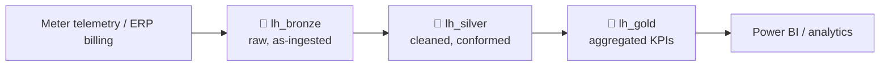

# demo-ontology-energy

Sample **medallion (bronze / silver / gold)** analytics project for the Schneider
Electric energy domain, deployed to **Microsoft Fabric** from CI/CD using a
**service principal** (non-interactive auth). Secrets are managed by GitHub Actions
and never stored in the repository.

## Architecture

Each medallion layer is a separate Fabric **lakehouse**:

| Lakehouse | Layer | Role |
|-----------|-------|------|
| `lh_bronze` | Bronze | Raw source extracts, as-ingested (string-typed + ingest metadata) |
| `lh_silver` | Silver | Cleaned, type-cast, deduplicated, conformed star model |
| `lh_gold`   | Gold   | Business-ready aggregates & KPIs for reporting |

## Data model

### 🥉 Bronze — raw landing zone
Raw tables mirror the source extracts. **All business columns are `string`**, plus
ingestion metadata (`ingested_at`, `source_file`). Immutable and reprocessable.

| Table | Business columns |
|-------|------------------|
| `raw_site` | site_id, site_name, country, region, latitude, longitude, site_type, contracted_power_kw, commissioned_date |
| `raw_device` | device_id, site_id, device_type, model, measurement_unit, install_location, is_active |
| `raw_meter_readings` | reading_id, device_id, site_id, timestamp, active_power_kw, energy_kwh, voltage_v, current_a, power_factor |
| `raw_billing` | cost_id, site_id, billing_period, energy_consumed_kwh, peak_demand_kw, tariff_rate, energy_cost, co2_emissions_kg, currency |

### 🥈 Silver — conformed star model
Cleaned and correctly typed. Two dimensions and two facts.

**`dim_site`** — monitored facilities
| Column | Type |
|--------|------|
| site_id (PK) | string |
| site_name | string |
| country | string |
| region | string |
| latitude | double |
| longitude | double |
| site_type | string |
| contracted_power_kw | double |
| commissioned_date | date |

**`dim_device`** — meters & sensors (e.g. PowerTag, PM8000)
| Column | Type |
|--------|------|
| device_id (PK) | string |
| site_id (FK → dim_site) | string |
| device_type | string |
| model | string |
| measurement_unit | string |
| install_location | string |
| is_active | boolean |

**`fact_energy_consumption`** — time-series meter readings *(partitioned by `reading_date`)*
| Column | Type |
|--------|------|
| reading_id (PK) | string |
| device_id (FK → dim_device) | string |
| site_id (FK → dim_site) | string |
| timestamp | timestamp |
| active_power_kw | double |
| energy_kwh | double |
| voltage_v | double |
| current_a | double |
| power_factor | double |
| reading_date | date |

**`fact_energy_cost`** — billing / tariff facts
| Column | Type |
|--------|------|
| cost_id (PK) | string |
| site_id (FK → dim_site) | string |
| billing_period | string |
| energy_consumed_kwh | double |
| peak_demand_kw | double |
| tariff_rate | double |
| energy_cost | double |
| co2_emissions_kg | double |
| currency | string |

### 🥇 Gold — aggregates & KPIs

**`agg_daily_consumption_by_site`** — daily consumption rollup
| Column | Type | Source |
|--------|------|--------|
| site_id | string | group key |
| reading_date | date | group key |
| total_energy_kwh | double | sum(energy_kwh) |
| avg_active_power_kw | double | avg(active_power_kw) |
| avg_power_factor | double | avg(power_factor) |
| reading_count | long | count(*) |

**`kpi_co2_by_region`** — sustainability & cost KPI by region
| Column | Type | Source |
|--------|------|--------|
| region | string | dim_site.region |
| billing_period | string | group key |
| total_co2_kg | double | sum(co2_emissions_kg) |
| total_energy_kwh | double | sum(energy_consumed_kwh) |
| total_cost | double | sum(energy_cost) |

## Transformation lineage

| From (Silver) | To (Gold) | Logic |
|---------------|-----------|-------|
| `fact_energy_consumption` | `agg_daily_consumption_by_site` | group by `site_id`, `reading_date`; sum/avg/count |
| `fact_energy_cost` + `dim_site` | `kpi_co2_by_region` | join on `site_id`; group by `region`, `billing_period`; sum CO₂/energy/cost |

Bronze → Silver applies type casting, `reading_date` derivation, null filtering on
keys, and deduplication on business keys.

## Repository layout

| Path | Purpose |
|------|---------|
| `src/auth.py` | Service-principal token for the Fabric REST API |
| `src/fabric_client.py` | Minimal REST client (auth verification) |
| `src/spark_utils.py` | Spark session authenticated to OneLake |
| `src/config.py` | Workspace / lakehouse config + OneLake paths |
| `src/schemas.py` | Per-layer Delta table schemas (`LAYER_TABLES`) |
| `src/provision_lakehouses.py` | Creates the 3 lakehouses via REST |
| `src/create_delta_tables.py` | Creates the per-layer Delta tables |
| `src/seed_bronze.py` | Seeds bronze with demo data |
| `src/transform.py` | Pipeline: bronze → silver → gold |
| `src/cleanup.py` | Resets lakehouse tables for a clean redeploy |
| `src/deploy_medallion.py` | End-to-end orchestrator |
| `.github/workflows/deploy.yml` | CI/CD deployment pipeline |

## Deployment

Deployed automatically by GitHub Actions (**Deploy Fabric medallion**) on push to
`main`, or manually via the Actions tab. Configuration:

- **Secret**: `AZURE_CLIENT_SECRET`
- **Variables**: `AZURE_TENANT_ID`, `AZURE_CLIENT_ID`, `FABRIC_WORKSPACE_ID`
- **Job env**: `RESET_TABLES` (wipe & rebuild), `SEED_DEMO_DATA` (load demo rows)

The service principal requires the *"Service principals can use Fabric APIs"*
tenant setting, a **Member/Contributor** role on the workspace, and the workspace
must be on a **Fabric capacity**.
